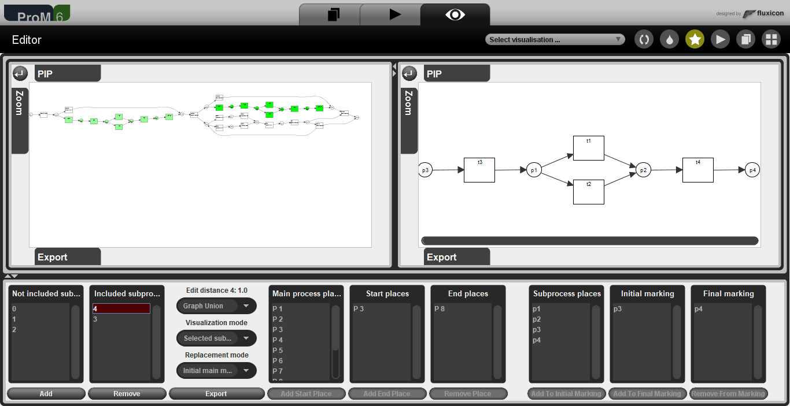

# ProM plugins for Process Repairing

## Table of contents

- [ProM plugins for Process Repairing](#prom-plugins-for-process-repairing)
  - [Table of contents](#table-of-contents)
  - [Usage](#usage)
  - [ProM](#prom)
  - [Introduction to Process Mining](#introduction-to-process-mining)
    - [Process Enhancement and Model Repairing](#process-enhancement-and-model-repairing)
    - [Updating a process](#updating-a-process)
  - [Project structure](#project-structure)
    - [Plugins](#plugins)
    - [Models](#models)
    - [Dialogs](#dialogs)
    - [Algorithms](#algorithms)

## Usage

This code can only be executed from the platform ProM, which can be downloaded from [here](https://www.promtools.org/doku.php). From the platform, search for "ProcessRepairing" to use the plugins.

## ProM

ProM is an extensible framework implemented in Java that supports a wide variety of process mining techniques in the form of plugins. There are 5 types of plugins:

- *Process Discovery* - They accept an event log as input and return a process model as output.
- *Conformance Checking* - They accept an event log and a process model as input and return a description of the discrepancies between the two as output.
- *Model Enhancement* - They accept an event log and a process model as input and return an updated process model as output.
- *Log Filtering* - They accept an event log as input and return a filtered event log or clustered event sublogs as output.
- *Analytics* - They accept an event log as input and return a log analysis as output.
- *Visualizer* - They accept any input and visualize a *JComponent* in the ProM GUI.

## Introduction to Process Mining

*Process Mining* is a family of techniques using Data Mining to extract relevant information from data stored in an *event log*, representing it into a *process model* (e.g. a Petri net).

There are 3 main types of Process Mining:

- *Process Discovery* - Generation of a process model from *trace logs* (a trace is a set of records in an event log representing a single instance of that process).
- *Conformance Checking* - Checking if there are discrepancies between an event log and a process model.
- *Process Enhancement* (or *Performance Mining*) - Updating a process model to improve metrics (i.e. *fitness*, *simplicity*, *precision*, *generalization*), or improving it after Conformance Checking.

The main metrics evaluating process models are:

- Fitness - Accurately modeling the observed behavior.
- Simplicity - Avoiding too complex models (*spaghetti-models*) with low level of abstraction.
- Precision - Accurately modeling traces in the event log (avoiding *underfitting*).
- Generalization - Accurately modeling traces in new instances of the real process (avoiding *overfitting*).

### Process Enhancement and Model Repairing

Modern techniques apply *Sub-process Discovery* to *event sublogs* rather than Process Discovery to an entire event log to achieve a tradeoff between *fitness* and *simplicity*.

In each iteration, the model is enhanced and repaired with new traces in that event log (or even different event logs). Every time the model is updated, we want to avoid losing the previous structure. So we want to minimize the number of updates to keep fitness and simplicity high), i.e. minimize the *edit distance* between the old model and the updated one.

### Updating a process

In this project, a process model is a Petri net, which is a directed graph consisting of nodes and edges. There are two types of nodes: *places* and *transitions*. Updating a process model means linking a sub-model to it. This is done by adding two *invisible transitions*:

- One between one or more initial places of the sub-model, called *initial marking*, to one or more places of the main model, called *initial location*.
- One between one or more final places of the sub-model, called *final marking*, to one or more places of the main model, called *final location*.

The linked sub-process is added to the main process as an "OR" connection, it doesn't replace the sub-process already existing between the initial and final location.

## Project structure

There are four packages in this repository:

- `plugins` - It contains the three ProM plugins. Each class is associated with a plugin by an annotation recognized by ProM.
- `models` - It contains the representations of Petri nets and subprocesses.
- `dialogs` - It handles the GUI.
- `algorithms` - It handles the logic and the algorithms to calculate the edit distance.

### Plugins

Three ProM plugins have been realized for Process Repairing. These plugins allow the ProM user to update a process model with a set of input sub-processes:

- `ProcessRepairing` - It accepts as input one main process, one sub-process, and the places to be linked (location and marking). It returns the updated model as output.
- `ProcessRepairingEditor` - It accepts as input one main process and one or more sub-process. It allows the user to select the processes to link, the locations, and the markings through a graphical interface.
- `ProcessRepairingVisualizer` - It provides the graphical interface for the `ProcessRepairingEditor` plugin.

A similarity measure (edit distance) between the new sub-process and the sub-process previously existing between the initial and final location is also provided.

### Models

The main models are:

- `PetrinetModel` - A representation of a process (not the process itself). It is a directed graph with nodes and edges, univocally identified with *labels*. There are two types of nodes: *places* and *transitions*. *Invisible transitions* are special transitions that are used to merge two Petri nets. The ProM platform already provides a `Petrinet` class but it's highly inefficient, merging two Petri nets has complexity $O(n^3)$). By contrast, the `PetrinetModel` class has complexity $O(n)$.
- `Subprocess` - Describes a process, it contains a `PetrinetModel` object along with extra information, including locations and markings and information about merged subnets.
- `State` - Handles the state of the interaction with the plugin. It contains information like the main process, the subprocesses, the selected subprocess, and various settings.

### Dialogs

The user interface for the `ProcessRepairingEditor` plugin is handled by the `ProcessRepairingVisualizer` plugin.

 

 
 

The `MainView` is divided into 5 sub-views:

- *MainPetrinetView* (top-left) - Visualizes the main process as a Petri net.
- *SubprocessPetrinetView* (top-right) - Visualizes the selected subprocess as a Petri net.
- *SubprocessListView* - Visualizes the list of input subprocesses (as labels) and the edit distance between the selected subprocess and the (replaced) subnet between the initial and final location. From this section, the user can add subprocesses to the main process and remove them, select a subprocess, and change the settings.
- *SubprocessLocationView* (bottom-center) - From this section, the user can select the location of the selected subprocess.
- *SubprocessMarkingView* (bottom-right) - From this section, the user can select the marking of the selected subprocess.

### Algorithms

The `algorithms` package handles the logic of the plugins. It handles model conversion and exporting, subnet extraction, and edit distance calculation.

The `SubnetExtractor` class is used to extract the subnet between the initial and final location from the main process (needed to calculate the edit distance). The algorithm is recursive and it has $O(n)$ complexity because it uses hash tables and the `PetrinetModel` class (with the `Petrinet` class provided by ProM the complexity would have been $O(n^2)$).

The edit distance between two graphs is a number between 0 and 1, where a lower value means a higher similarity. A higher edit distance means a higher number of operations (inserting, editing, or removing nodes and edges) needed to transform a graph into the other. This can be computationally expensive, so it is generally calculated by using heuristics.

Two examples of heuristics are the *MCS* (*Max Common Subgraph*) and the *GU* (*Graph Union*). They both count the common edges between the two graphs, but *MCS* normalizes this number to the max number of edges between the two graphs, and *GU* normalizes it by the number of edges in the union between the two graphs.

Let $E_1$ be the set of edges in the first graph and $E_2$ the set of edges in the second graph. The *MCS* and the *GU* are defined as follows:

$$MCS(E_1, E_2) = 1 - \frac{|E_1 \cap E_2|}{max(|E_1|, |E_2|)}$$

$$GU(E_1, E_2) = 1 - \frac{|E_1 \cap E_2|}{|E_1| + |E_2| - |E_1 \cap E_2|}$$

Again, these algorithms are very efficient with the use of hash tables and the `PetrinetModel` class. Counting edges in a graph has a $O(n)$ complexity ($O(n^2)$ with the `Petrinet` class). Counting common edges between two graphs has a $O(min(n, m)*n)$ complexity ($O(n^2m^2)$ with the `Petrinet` class).

These and other heuristics are implemented in the package `algorithms.editdistance`.
